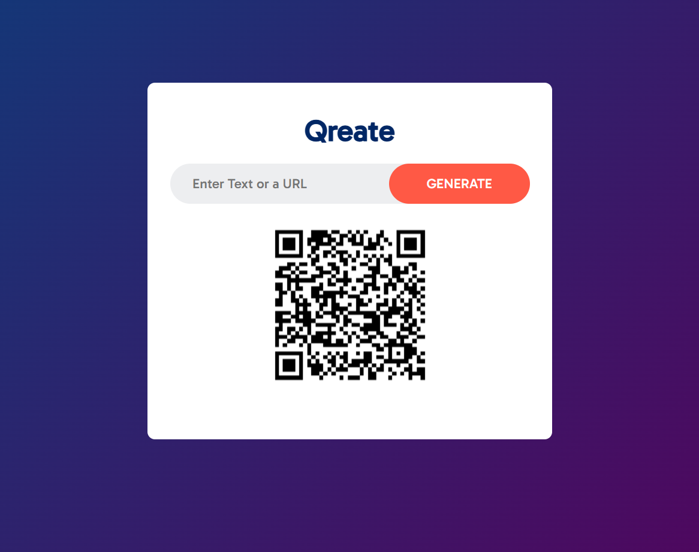
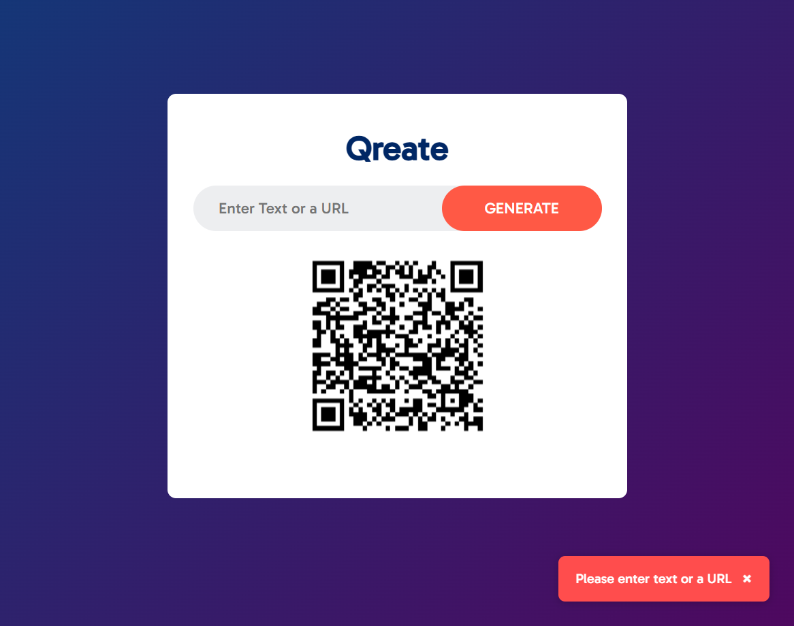

# **🔳 Qreate - QR Code Generator**

- **Qreate** is a modern and user-friendly QR code generator that allows you to instantly create QR codes from any text or URL. With a clean UI and smooth animations, Qreate offers a delightful experience for users who want a fast and reliable way to generate QR codes. It also includes helpful toast notifications for input validation and features an elegant fade-in effect when displaying the generated QR.

# **🚀 Features**

- 🔳 **Generate QR Codes**: Input any text or URL and click `GENERATE` to instantly create a QR code.
- ⚠️ **Input Validation**: If the input is empty, a friendly toast message appears prompting the user to enter valid data.
- ✨ **Smooth Animation**: The QR code appears with a clean fade-in animation for better visual feedback.
- 🎨 **Stylish UI**: Clean, centered layout with rounded elements and modern colors for a visually pleasant experience.

# **📸 App Screens**

 

